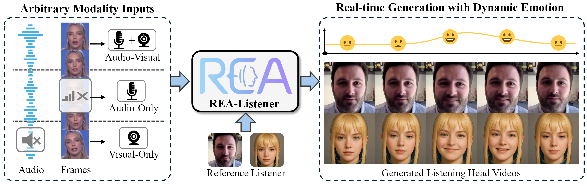

<h1 align="center">REA-Listener: Real-Time Listening Head Generation with Dynamic Emotion Modeling and Flexible Modality Adaptation</h1>

<p align="center">
  <a href="https://dl.acm.org/doi/abs/10.1145/3746027.3755093"></a>
  <a href="https://aipixel.github.io/REA-Listener/"></a>
  <a></a>
</p>


<p align="center">
  
</p>

# Open-Source TODO List

- 🟩 Model code
- 🟩 Inference code
- ⬜️ Environment setup
- ⬜️ Checkpoints
- ⬜️ Training guide for custom data

# Acknowledgments


This repository was developed with reference to the following projects, We thank the original authors for their valuable work: [ViCo Challenge Baseline](https://github.com/dc3ea9f/vico_challenge_baseline), [ListenFormer](https://github.com/liushenme/ListenFormer), [GAGAvatar](https://github.com/xg-chu/GAGAvatar).


# 📚Citation

```bibtex
@inproceedings{realistener2025,
  title={REA-Listener: Real-Time Listening Head Generation with Dynamic Emotion Modeling and Flexible Modality Adaptation},
  author={Zhao, Sizhe and Wang, Chenyang and Zhao, Weiyu and Li, Zonglin and Li, Ming and Zhang, Shengping},
  booktitle={Proceedings of the 33rd ACM International Conference on Multimedia},
  pages={9733--9742},
  year={2025}
}
```